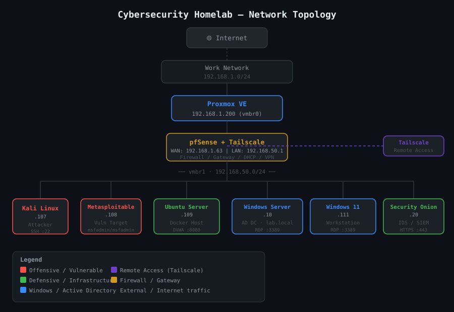

# Enterprise Cybersecurity Homelab

A self-hosted cybersecurity practice environment built with Proxmox. This portfolio documents virtualization, network security, Active Directory, Windows and Linux administration, security monitoring, and controlled security testing in an isolated lab.

## Lab Hardware

| Component | Specification |
| --- | --- |
| CPU | Intel i7-10900K |
| Memory | 64 GB RAM |
| Storage | 2 TB SSD |
| Hypervisor | Proxmox VE |

## Project objectives

- Configure and document a segmented virtual lab.
- Practice Active Directory, endpoint, Linux server, and firewall administration.
- Study SIEM, IDS/NSM, log analysis, threat hunting, and incident-response workflows.
- Test only lab-owned, intentionally vulnerable systems.

## Architecture overview

Proxmox hosts the virtual environment. pfSense separates an upstream network from an internal lab segment. Windows Server provides Active Directory to a Windows 11 workstation. Ubuntu hosts DVWA and WebGoat. Kali and Metasploitable support controlled testing. Security Onion provides monitoring. Tailscale enables private remote administration without exposing management services.

## Technology stack

Proxmox VE, pfSense, Tailscale, Windows Server and Active Directory, Windows 11, Ubuntu Server, Docker, DVWA, WebGoat, Kali Linux, Metasploitable, Security Onion, Zeek, Suricata, and Elastic Stack concepts.

## Network segmentation and security design

pfSense separates the internal lab and upstream network paths. Security Onion observes mirrored lab traffic for monitoring practice. Addresses, domains, hostnames, user names, and remote-access identifiers are redacted from public documentation.

## Systems and virtual machines

- Proxmox hypervisor
- pfSense firewall/router
- Windows Server with Active Directory
- Windows 11 domain-joined workstation
- Ubuntu server hosting DVWA and WebGoat
- Kali Linux testing workstation
- Metasploitable vulnerable target
- Security Onion monitoring platform

## Skills demonstrated

Virtualization, network security, Active Directory administration, Windows and Linux administration, SIEM and network monitoring concepts, IDS/NSM concepts, log analysis, threat hunting, vulnerability assessment, attack simulation, incident-response practice, and technical documentation.

## Security monitoring and defensive operations

Security Onion supports practice with Zeek and Suricata telemetry, log review, investigation notes, and network-monitoring workflows. This repository does not claim detections, incidents, or results that are not documented with supporting evidence.

## Offensive-security testing conducted in the isolated lab

Authorized exercises are limited to lab-owned, intentionally vulnerable systems such as Metasploitable, DVWA, and WebGoat. Testing is documented as a learning activity and paired with expected telemetry and cleanup steps where evidence is available.

## Repository structure

The repository contains the main README; architecture notes; platform configuration documentation; detection and hunting templates; sanitized diagrams; screenshot guidance; and walkthrough templates.

## Screenshots

Sanitized screenshots will be added as completed configurations and walkthroughs are documented. See [screenshots/README.md](screenshots/README.md) for publication guidance.

## Current progress

Core platform, segmentation, monitoring, and safe-documentation practices are recorded. The next documentation additions will focus on sanitized evidence from completed lab exercises.

## Future roadmap

- Add redacted screenshots for configured systems and monitoring views.
- Add evidence-based attack-and-detection walkthroughs.
- Document network-flow validation and detection hypotheses.
- Add safe automation only when a repeatable task is implemented.

## Ethical-use disclaimer

All offensive-security testing is performed only against systems owned by me inside this isolated lab. No instructions or artifacts are intended for unauthorized access. Secrets and identifying infrastructure details have been removed from the public repository.
